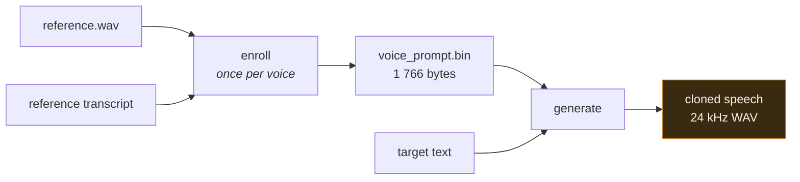
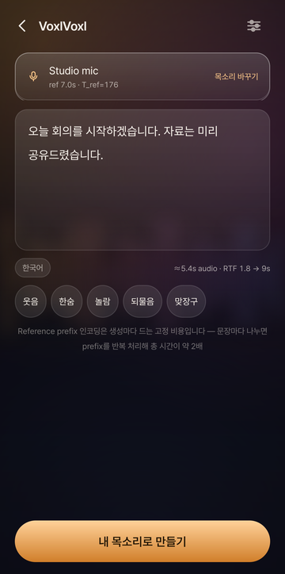
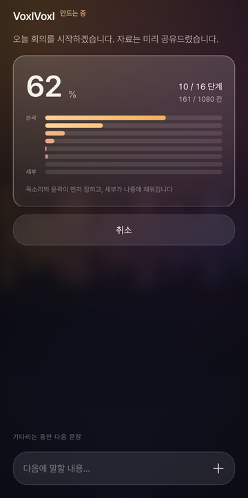
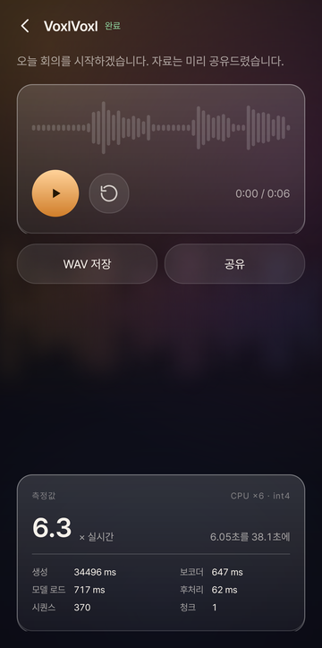
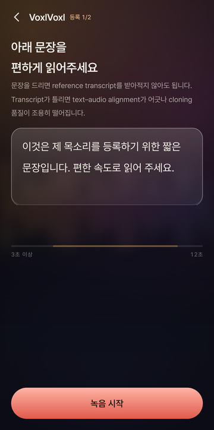
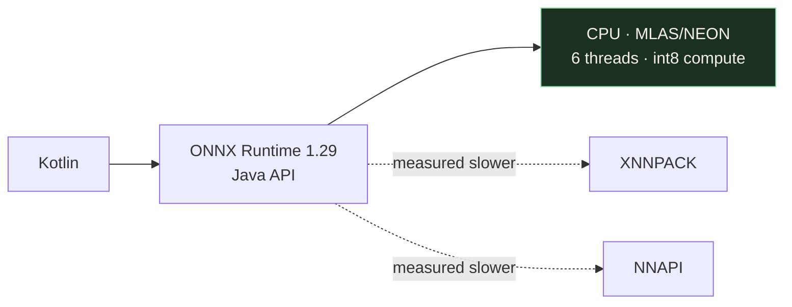

# VoxlVoxl — OmniVoice Android On-Device PoC

Run [k2-fsa/OmniVoice](https://github.com/k2-fsa/OmniVoice) voice-cloning TTS **entirely on
a phone**, with no network access at inference time — not "no network calls we know of",
but an APK that declares no `INTERNET` permission and gets `EPERM` from the kernel if it
tries.



**Status: all five levels of the brief reached on real hardware.** PC ONNX inference,
on-device model loading, on-device voice cloning, enforced offline operation, and the full
backend / thread / step benchmark — measured on a **Galaxy S26 Ultra (SM-S948N, Snapdragon
8 Elite Gen 5, Android 16)**.

| | |
|---|---|
| Deterministic ONNX vs PyTorch, re-masking NLL judge | **2.7325** vs **2.7672** — interchangeable, not merely close |
| Fastest backend on device | **plain CPU**, 6 threads (XNNPACK +13 %, NNAPI +17 % slower) |
| 5.4 s utterance, 16 steps, int4 | **19.4 s — RTF 3.6** |
| 19.3 s utterance | **54.1 s — RTF 2.8** |
| Peak memory | 769 MB PSS at S = 188, 1.45 GB at S = 757 |
| Voice profile on disk | **1 766 bytes**, no audio kept |
| Network permissions in the manifest | **none** |

<table>
<tr>
<td></td>
<td></td>
<td></td>
</tr>
<tr>
<td align="center"><sub>write · the estimate is the device's own measured RTF</sub></td>
<td align="center"><sub>generate · the ladder is the model's real un-masking state</sub></td>
<td align="center"><sub>done · every number here was measured on this run</sub></td>
</tr>
<tr>
<td></td>
<td></td>
<td></td>
</tr>
<tr>
<td align="center"><sub>enroll · the script is given, so the transcript is exact</sub></td>
<td align="center"><sub>voices · 1.8 kB of codec codes each, never a recording</sub></td>
<td></td>
</tr>
</table>

The progress screen is not a decorative spinner. OmniVoice un-masks an 8xT grid of codec
tokens with `layer_penalty_factor = 5.0`, so lower codebooks resolve first, and those eight
bars are the real per-codebook fill read back out of the loop — the staircase in the
screenshot is the model, not an animation.

Numbers in [`docs/benchmark.md`](docs/benchmark.md); why the obvious shortcut
(`onnx-community/OmniVoice-Onnx`) does not work in
[`docs/onnx-reuse-audit.md`](docs/onnx-reuse-audit.md).

---

## The one-paragraph version

OmniVoice is a **masked diffusion LM**, not an autoregressive codec LM: a Qwen3-0.6B
backbone with **bidirectional** attention, run over the whole sequence once per un-masking
step while filling in cells of an 8×T audio-token grid, then decoded to 24 kHz by the Higgs
Audio V2 codec. Bidirectional attention means **no KV cache is possible**, so the cost is
`steps × 2 CFG branches × full forward` — about **13 TFLOP for 5 s of audio** at the
upstream default of 32 steps. That number, not operator support, is the real obstacle on a
phone. We ship 16 steps, which the judge says costs nothing measurable.

The published community ONNX conversion exports the backbone with
`com.microsoft::GroupQueryAttention`, which is causal — so it cannot reproduce the model
regardless of precision. We export the backbone ourselves as one fused bidirectional
graph and reuse only that repo's Higgs codec graphs.

---

## Setup

### 1. PC environment

```bash
uv venv --python 3.12 .venv
uv pip install --python .venv/bin/python -r scripts/requirements.txt
# for export + the PyTorch golden reference:
uv pip install --python .venv/bin/python \
    "torch>=2.8" "torchaudio>=2.8" "transformers>=5.4" "omnivoice==0.2.1"
```

### 2. Model download  (~4 GB)

```bash
.venv/bin/python scripts/download_models.py
```

Fetches `k2-fsa/OmniVoice` (PyTorch source of truth, 3.3 GB) and the reusable Higgs codec
ONNX graphs from `onnx-community/OmniVoice-Onnx` (740 MB fp32), then sanity-checks the
config against `docs/model-analysis.md` §1.

### 3. Golden reference

```bash
# synthesise sample/reference.wav (voice-design mode, so its transcript is exact)
.venv/bin/python scripts/reference_infer.py bootstrap
# the golden voice-cloning run + every intermediate tensor
.venv/bin/python scripts/reference_infer.py clone
```

### 4. ONNX export and validation

```bash
.venv/bin/python scripts/export_onnx.py --precision fp32          # 2.45 GB
.venv/bin/python scripts/sweep_quant.py --keep android_b32        # → models/onnx/int4, 422 MB
.venv/bin/python scripts/validate_onnx.py --stage all
```

`sweep_quant.py` measures 16 quantization variants; `--keep` installs one.
`export_onnx.py --precision int4` reproduces the chosen one directly.

### 5. Run the whole thing from ONNX

```bash
.venv/bin/python scripts/infer_onnx.py enroll \
    --ref-audio sample/reference.wav --ref-text "$(cat sample/reference.txt)" \
    --out out/voices/me.bin                       # 1766 bytes

.venv/bin/python scripts/infer_onnx.py generate \
    --voice-prompt out/voices/me.bin --text "$(cat sample/target.txt)" \
    --lm models/onnx/int4/omnivoice_lm.onnx --num-step 16 \
    --out out/onnx/cloned.wav
```

### 6. Model placement on device *(Phase 4)*

```bash
.venv/bin/python scripts/prepare_android_models.py     # → models/android/, 520 MB
adb push models/android/. /sdcard/Android/data/<pkg>/files/models/
```

`assets/` is not used: a ~500 MB asset breaks the install size limit and is decompressed
on every read. The app copies to app-private `filesDir/models/` on first launch and
verifies `manifest.json` checksums. **No model is ever fetched over the network.**

### 7. Android build *(Phase 4)*

```bash
cd android/OmniVoicePoC && ./gradlew assembleRelease
adb install -r app/build/outputs/apk/release/app-release.apk
```

---

## Architecture

See [`docs/architecture.md`](docs/architecture.md). Short form:



No Python on device. No Termux, Chaquopy, embedded CPython or PyTorch-Android.

| on-device component | provenance |
|---|---|
| Qwen2 byte-level BPE | Kotlin port reading `tokenizer.json` |
| duration estimator | Kotlin port of `RuleDurationEstimator` (Apache-2.0) |
| prompt build + CFG unmasking loop | Kotlin port of `_generate_iterative` (Apache-2.0) |
| `omnivoice_lm.onnx` | exported by `scripts/export_onnx.py` |
| `higgs_*.onnx` | reused from `onnx-community/OmniVoice-Onnx` |
| silence-trim / re-gain / fade | Kotlin port of `_post_process_audio` (Apache-2.0) |

---

## Benchmark — Galaxy S26 Ultra, measured

All at int4, guidance 2.0, cold device. Full tables and method in
[`docs/benchmark.md`](docs/benchmark.md) §7.

| backend | threads | steps | audio | latency | RTF | peak PSS |
|---|---:|---:|---:|---:|---:|---:|
| **CPU** | **6** | **16** | 19.28 s | **54.1 s** | **2.8** | 1.45 GB |
| **CPU** | **6** | **16** | 5.35 s | **19.4 s** | **3.6** | — |
| CPU (before §5.1) | 6 | 16 | 6.05 s | 38.1 s | 6.3 | 769 MB |
| CPU (before §5.1) | 6 | 16 | 1.88 s | 18.5 s | 11.3 | 591 MB |
| CPU | 6 | 8 | 1.88 s | 7.6 s | 5.4 | — |
| CPU | 6 | 32 | 1.88 s | 40.5 s | 24.6 | — |
| XNNPACK | 6 | 16 | 1.88 s | 20.5 s | 12.5 | — |
| NNAPI | 6 | 16 | 1.88 s | 21.1 s | 12.9 | — |
| CPU | 1 | 16 | 1.88 s | 69.3 s | 38.2 | — |
| CPU | 8 | 16 | 1.88 s | 29.5 s | 17.3 | — |

Two results in that table are worth reading twice.

**8 threads is worse than 6.** The SoC is 6 Oryon at 3.63 GHz plus 2 at 4.74 GHz; threads 7
and 8 land on the prime cores and the whole step then waits on migration and shared thermal
budget. 6 is the setting the app ships.

**A longer sentence is cheaper per second.** RTF 2.8 for 19.3 s of audio against RTF 3.6 for
5.4 s — the reference prefix is a fixed cost paid once per generation, so short utterances
amortise it over almost nothing. The app says so in the compose screen's hint rather than
hiding it.

---

## What was done about speed

Everything below was measured, on this graph, on this device. Nothing here is a technique
that "should" help.

**Shipped, and where the speed actually came from:**

| technique | effect | why |
|---|---|---|
| **int8 compute (`accuracy_level=4`) + ORT 1.29** | **2.3x** | the shipping graph asked for fp32 compute, so ARM64's int4 kernels could never dispatch — see below |
| **prefix KV cache** | **1.3–1.9x** — 1.93x at a 74 % prefix, 1.30x at 40 % | the reference prefix never changes between steps, so it is encoded once and every later forward runs over the generated positions only; costs ~130 MB peak PSS |
| int4 weight-only, block 32, audio head kept fp32 | 2.45 GB → **422 MB**, ~5.8x less to read per step | the graph is 85 % `MatMulNBits`; memory bandwidth is the wall |
| `num_step` 32 → **16** | **2.2x** (RTF 24.6 → 11.3) | 16 keeps the judge score; the upstream default of 32 buys nothing measurable here |
| 6 intra-op threads, not 8 | **1.5x** vs 8 threads | see above — the prime cores hurt |
| CPU EP, not XNNPACK or NNAPI | **1.13x / 1.17x** vs those | §7.4 — with dynamic shapes both accelerators claim **0 of 2785 nodes** |
| voice-prompt cache (`voice_prompt.bin`, 1 766 B) | the ~3 s encode happens **once per voice**, not once per sentence | the reference codes are all the model needs |
| chunked long text + a batch queue | the fixed prefix cost is paid once for many sentences | measured: splitting per sentence roughly **doubles** total time |
| offline-optimized graph, built on device at first launch | **load 1.47x** (1279 → 870 ms) | ORT keeps the external-data reference, so the saved file is 693 KB |

**The largest single win was a default nobody had questioned.** `MatMulNBits` carries an
`accuracy_level` attribute that picks the *compute* type of the int4 GEMM — it touches no
stored weight. The shipping graph was at level 1 (dequantize to fp32, fp32 GEMM), so the
85 % of device runtime that is `MatMulNBits` ran on the generic MLAS path and ONNX
Runtime's ARM64 int4 kernels — which need int8 activations — could never dispatch. Level 4
(`SQNBIT_CompInt8`) plus a runtime bump is worth **2.3x**, for no measurable quality cost
across three seeds. Neither half works alone: the version bump gives 1.05x, the attribute
alone 1.25x. Full working in [`docs/research-notes.md`](docs/research-notes.md) §5.1.

**Tried, measured, and rejected — with the numbers:**

- **Confidence-aware parallel decoding** (Fast-dLLM, arXiv:2505.22618). Commit every cell
  whose probability clears a threshold instead of a fixed `k` per step. Implemented behind
  `--confidence-threshold`; **LM calls never dropped below 32**. `scripts/speed_probe.py`
  shows why: at step 8, out of 353 masked cells, **3** exceed p > 0.9 while the schedule was
  already taking 8. A text diffusion LM is often overwhelmingly sure of the next word; an RVQ
  audio cell is one of 1025 near-equivalent codes, and the model's own NLL here is ~2.75 —
  perplexity near 15. A model that is never confident cannot be accelerated by trusting its
  confidence.
- **Dropping classifier-free guidance.** Halves the work on paper. `guidance_scale = 0`
  produces **1.92 s entirely below −50 dBFS** — silence. The unconditional branch is
  load-bearing, not overhead.
- **int4 in the audio head, or block size > 32.** Both drop quality below the level of simply
  re-running fp32 with different sampling noise. §1.
- **NNAPI with pinned shapes.** Gets the partitioner from 0 to 142 nodes, which then run
  **5.6x slower** than the whole graph on CPU.
- **QNN / Hexagon.** The right accelerator for this SoC. The runtime blocker we hit — ORT
  1.22's bundled QNN SDK shipping V79 HTP skels against the device's V81 — is gone in newer
  ORT, but the project is not: the QNN EP still needs static bucketed shapes and a quantized
  model with no `MatMulNBits` path, and our QDQ a16w8 attempt measured NLL 3.331, past the
  noise floor, at 1209 ms against 766 ms on CPU. §7.7.

**Taken since:** the approximate **prefix KV cache** — see the table above and [`docs/research-notes.md`](docs/research-notes.md) §7.1. The reasoning that priced it: Bidirectional
attention forbids a cache across the generated region — that is §1.1's central finding — but
the reference prefix does not change from step to step, and at S = 188 it is 140 tokens,
**74 % of the sequence**, re-encoded every time. Trimming the reference prices that directly:
1.0 s of reference instead of 4.1 s makes a forward **2.01x** faster. Caching it rather than
truncating it would keep the voice and needs a re-export carrying `past_key_values` on the
prefix range. That is the remaining lever.

---

## Known limitations (current, honest)

- **This is asynchronous synthesis, not interactive TTS.** Bidirectional attention forbids a
  KV cache, so every step re-reads the full sequence: `16 steps × 2 CFG branches × full
  forward`, about 13 TFLOP for 5 s of audio. RTF 6.3 is fine for "type a message, generate it,
  send it" and unusable for anything conversational. The ceiling is structural, not an
  implementation gap.
- **Sustained throughput is about half of cold.** `thermal_status` never left LIGHT, so this
  is ordinary DVFS rather than throttling — but the second and third generation in a row are
  slower than the first, and the app surfaces the thermal state instead of pretending
  otherwise. §7.6.
- **`guidance_scale = 0` is not a speed lever.** It produces pure silence.
- **int4 has two hard constraints.** `/audio_heads/MatMul` must stay fp32 and the block size
  must be 32. §1.
- **NNAPI does not help**, and is deprecated as of Android 15. The real accelerator option
  on this device is QNN / Hexagon — see above.
- **The reference transcript is typed by the user.** No Whisper in v1, by design. The app
  hands the user a script to read so the transcript is exact rather than remembered.
- **Long text is expensive**, quadratically so — attention is `O(S²)` and `S` includes the
  reference prefix. Chunking is the mitigation, not a fix.
- Exports are pinned to **opset 20**; the Android AAR is 1.29 and loads them unchanged.
- **Peak memory scales with utterance length** — 769 MB at S = 188, 1.45 GB at S = 757.
  Comfortable inside 11.4 GB, but anything much longer should be chunked.

## Repository layout

```
docs/
  model-analysis.md    Phase 1 — what OmniVoice is, exactly, with the cost model
  onnx-reuse-audit.md  Phase 2 — what already exists and what is actually usable
  plan.md              phased plan, contingencies, deliverables checklist
  architecture.md      on-device component and session design
  benchmark.md         every measurement, PC and device, including the failed experiments
  feature-validation.md  each spec ID against what the device actually did
  research-notes.md    the lab notebook — method, and every experiment that failed
scripts/               PC-side: download, export, validate, ONNX reference inference,
                       quantization sweep, speed and codebook-ablation probes
design/                the design canvas the app's screens were built from
android/OmniVoicePoC/  the app
models/                gitignored — see models/README.md
sample/                reference.wav / reference.txt / target.txt
```

## Licences

OmniVoice code and weights, the ONNX conversions we reuse, and sherpa-onnx are Apache-2.0;
ONNX Runtime is MIT.

**The Higgs Audio V2 codec weights are not.** They ship under the *Boson Higgs Audio 2
Community License* (a Llama-3-derived licence, `models/omnivoice/audio_tokenizer/LICENSE`):
royalty-free, but it requires attribution ("Built with Higgs Materials licensed from Boson
AI USA, Inc." + the Llama 3 notice), binds you to the Llama 3 Acceptable Use Policy,
prefixes derivative model names with "Higgs Audio 2", and **requires an expanded licence
from Boson AI above 100,000 annual active users**. The codec is not optional — it *is*
OmniVoice's audio representation — so this term applies to any product built on OmniVoice.
See `docs/onnx-reuse-audit.md` §6.

The `ggml` community ports and `AFun9/Omnivoice-onnx` are **not** usable commercially —
see `docs/onnx-reuse-audit.md` §2 and §4.
