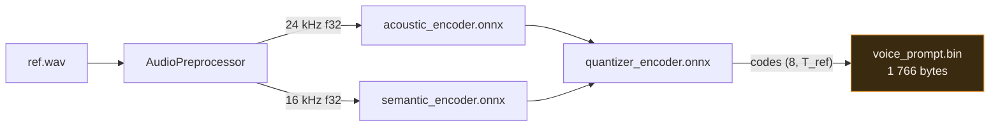
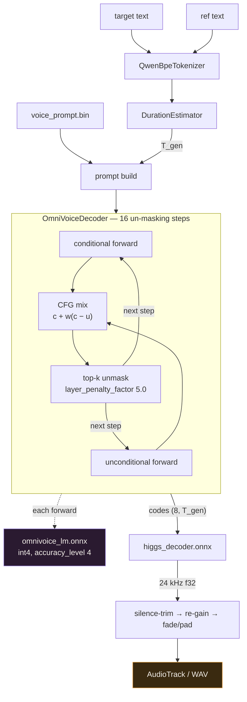
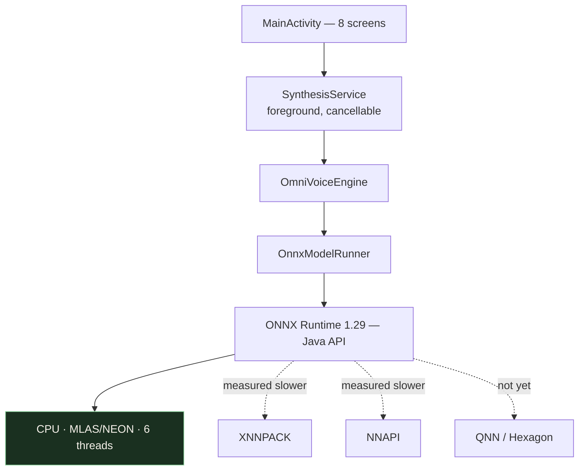

# Target Architecture

## Enrollment — once per speaker



The recording itself is never kept. What survives enrollment is 1 766 bytes of
codec codes, which is why a leaked profile is not a leaked recording.

## Generation — once per utterance



Both branches of the CFG mix are full forwards over the whole sequence, and
there are two of them per step, because the backbone's attention is
bidirectional and no KV cache is possible. That loop is the entire cost of the
system — see [`research-notes.md`](research-notes.md) §2.

## Stack



No Python on device. No Termux, Chaquopy, embedded CPython or PyTorch-Android.

## Sessions and their lifetimes

| session | file | precision | loaded when | freed when |
|---|---|---|---|---|
| `omnivoice_lm` | `omnivoice_lm.onnx(+.data)` | int4, int8 compute | first generate | app background (configurable) |
| `higgs_decoder` | `higgs_decoder.onnx` | fp32 | first generate | with the LM |
| `acoustic_encoder` | `acoustic_encoder.onnx` | fp32 | enrollment only | immediately after enrollment |
| `semantic_encoder` | `semantic_encoder.onnx` | fp32 | enrollment only | immediately after enrollment |
| `quantizer_encoder` | `quantizer_encoder.onnx` | fp32 | enrollment only | immediately after enrollment |

Enrollment sessions are opened, used and closed inside one `use {}` block so their
~650 MB never coexists with the generation sessions.

## Files on device

```
filesDir/
  models/
    omnivoice_lm.onnx             graph only, 1.4 MB
    omnivoice_lm.onnx.data        weights, 421 MB
    higgs_decoder.onnx
    acoustic_encoder.onnx         (optional — enrollment build only)
    semantic_encoder.onnx         (optional)
    quantizer_encoder.onnx        (optional)
    tokenizer.json
    manifest.json                 sha256 + sizes, checked on first launch
  voices/
    <id>.bin                      the codec codes
    <id>.name                     the display name, so a rename never rewrites codes
```

`.onnx.data` must sit next to its `.onnx` — ORT resolves the external-data path relative
to the model file, which is why models live in `filesDir`, not in `assets`.

## Threading

- One `OrtEnvironment` per process.
- `intra_op_num_threads` = **6**. Measured: 8 is *worse* than 6, because threads 7
  and 8 land on the two prime cores and the step then waits on migration.
- Generation runs on `Dispatchers.Default` inside a cancellable coroutine; every step
  checks `ensureActive()` so Cancel is responsive.
- Input tensors for the LM are allocated once per utterance and rewritten in place across
  steps (`OnnxTensor.createTensor` on a reused `LongBuffer`/`ByteBuffer`) — `S` is constant
  within one utterance, which is the whole reason the no-KV-cache design is tolerable here.
